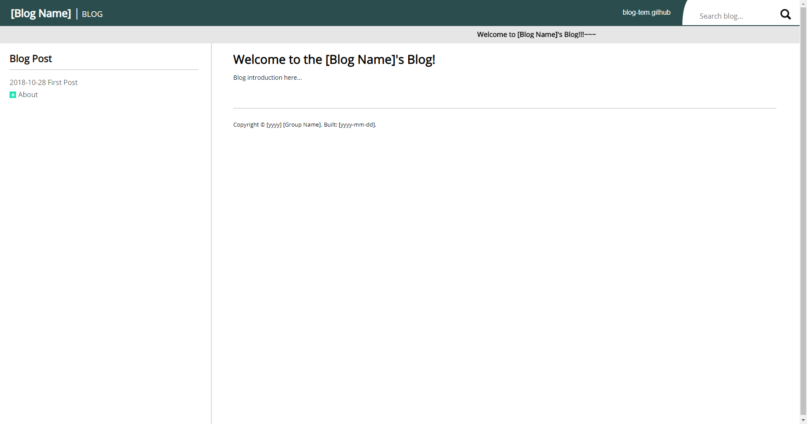
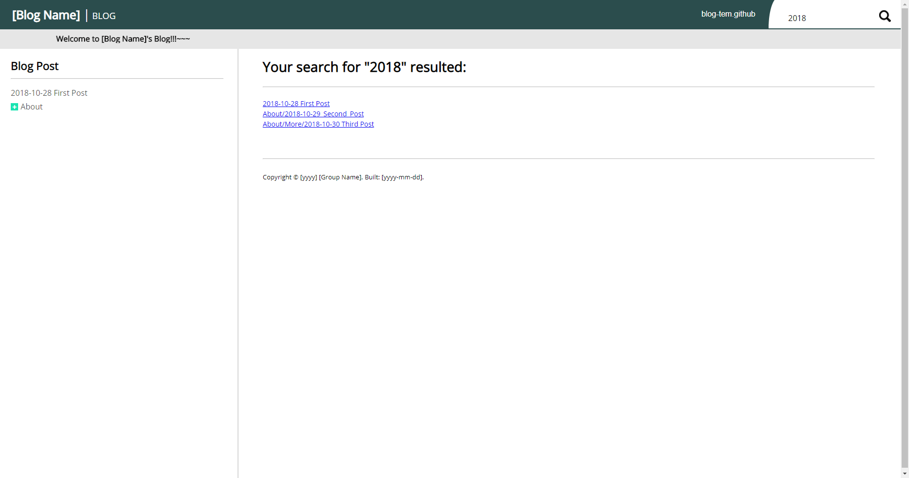

# Blog Template #

* Demo: <a href="http://www.jcs-profile.com:4000">Blog_Template</a>

The goal of this project is easy to implement blog post in basic 
HTML/CSS. User can create individual `.html` file and start wrting 
the blog without hassle linking the page to the home website. 
Caution, this is a blog template and does not have a good looking 
design but this project have most of the stuffs and features 
implemented to be just a plain blog.   

## Acknowledge ##
This application is using NodeJS for the backend. You might need
some knowledge of `express.js` in order to expand the application
if you need to. The frontend are only using the basic `HTML`, `CSS`,
and `jQuery`. You will also need the minimal knowledge of these tools.

## How to use? ##
All the blog post file are search default under `./website/Blog/doc` 
directory. The blog system is design for organizing by category 
instead oranizing by time. If you are planning on using this 
project and organize by time then you will have to manually name 
the file/directory by time. 

## Run the application ##
Before you run the application, make sure you install node.js to
your OS environment. Step one, run `./scripts/setup.bat`, this
file will install all the dependencies you need for this project.
Step two, run `./scripts/run.bat` in order to start the server.
If you are running of Linux environment with bash installed, just
execute the same scripts but with `.sh` extension behind.
Step three, run you favorite web browser with `localhost:4000` and
the following screens should appear infront of you.

### Introduction Screen ###

## Deploy on to server ##
If you are ready to deploy your scripting manual application, run
`./scripts/start_forever.bat` and the server will run even you terminated
the console. If you want to stop the server, run `./scripts/stop_forever.bat`
to terminate the previous started server. If you are on linux distro
with bash installed, run the same script but with `.sh` extension behind.

## Search Engine ##
Search engine is implemented by simply comparing the file name with keyword 
case insensitively.

## Configuration ##
If you do not like any of these settings, checkout `./config.js` and `./website/js/config.js`.
You can change the path, manual name, version number, copyright text, etc.
Basically anything you need to make a API reference document website.

If you do not like style you can load you own CSS file at `./website/css-lib.html`.
Or change the CSS property in `./website/css/style.css`. For the content's style can
be found in `./website/css/content.css`.

## Example ##
* <a href="http://www.jcs-profile.com:4001">JenChieh's Blog</a>
